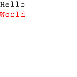

Stuff for open e paper link displays
====================================

Based on https://github.com/OpenEPaperLink/OpenEPaperLink/wiki/Image-upload/e1cd235984c7ed3b5c54e3f862e783ea196ef40d

Requirements
------------

1. Access Point, flashed with openepaperlink.de or compatible
2. python3 (with PIL)
3. Any good operating system (this - of course - excludes Micro$oft Windows; might work but untested)

Example Usage
-------------

### Generate Image

_for a 1.54" tag_

```bash
./eink_create_img.py -i '{"t":"Hello","f":"/usr/share/fonts/truetype/freefont/FreeMono.ttf","s":16,"c":1,"x":0,"y":0,"a":0}' \
                        '{"t":"World","f":"/usr/share/fonts/truetype/freefont/FreeMono.ttf","s":16,"c":2,"x":0,"y":20,"a":0}' \
	             -o helloworld.jpg \
	             -r 0 \
	             -s 1.54 \
	             -vv
```

Produced Image:



### Generate and Upload Image

_for a 2.9" tag, in **w**ide (not **t**all) orientation_

```bash
./eink_create_img.py -i '{"t":"Hello","f":"/usr/share/fonts/truetype/freefont/FreeMono.ttf","s":16,"c":1,"x":0,"y":0,"a":0}' \
                        '{"t":"World","f":"/usr/share/fonts/truetype/freefont/FreeMono.ttf","s":16,"c":2,"x":0,"y":20,"a":0}' \
	             -o helloworld.jpg \
	             -r 0 \
	             -s 2.9w \
	             -vv \
		     -u 'http://192.168.178.192' '00000197E5CB3B38' # the first four '0' can be ommitted
```

How it Works
------------

Its ugly documented python. The code is documentation enough.
